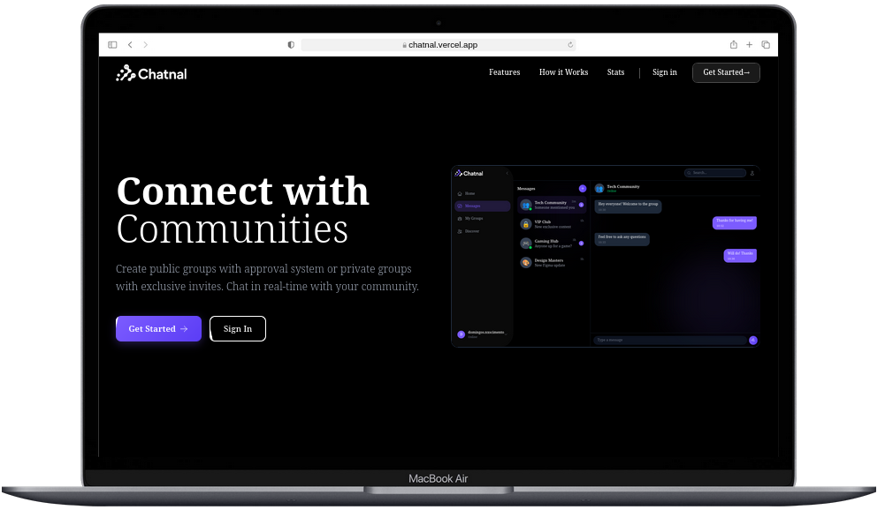
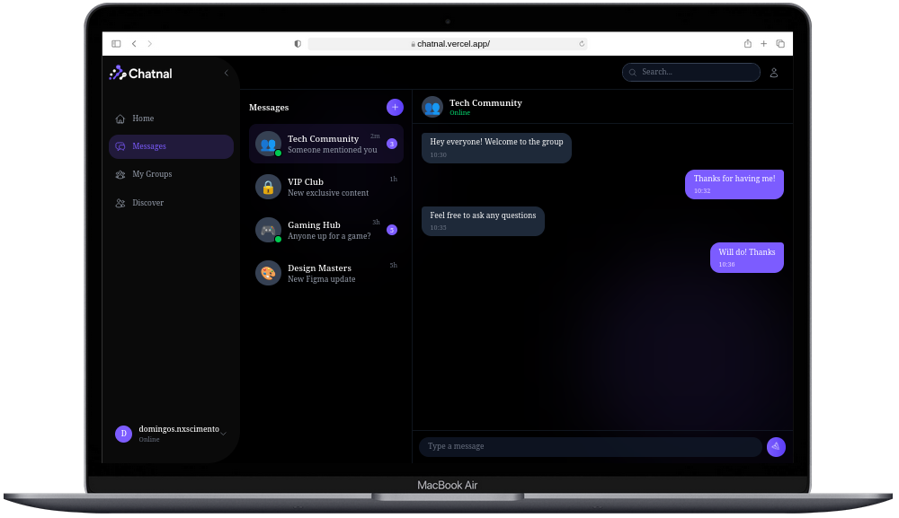

<div align="center">
   
  </br> </br>
  
  [](https://github.com/Adyllsxn/chatnal)
  [](https://chatnal.vercel.app)
  [](docs/Setup.md)
  [](LICENSE)

</div>

---

## 📖 ABOUT THE PROJECT

> **Chatnal** is a modern chat platform that combines the best of both worlds: public groups with an approval system and private groups with exclusive invites. Inspired by WhatsApp and Discord functionality, Chatnal offers a complete real-time communication experience.

### ✨ Features:
```markdown
✅ Public groups with join requests and admin approval
✅ Private groups with unique invite link generation
✅ Real-time chat with WebSockets (Socket.io / SignalR)
✅ Secure authentication with JWT
✅ Responsive interface (PC, tablet, and smartphone)
✅ Persistent messaging system
✅ Real-time notifications
✅ Chat history
```

### **🔧 Application Flow**
> User creates account → Discovers public groups or gets invited → Requests to join or accepts invite → Admin approves → Real-time chat starts

### 📊 Group Types

| Type | How it works |
|------|-------------|
| **Public with approval** | Appears in the general list → User requests to join → Admin approves → User becomes a member |
| **Private with invite** | Does not appear in the list → Admin generates unique invite → User joins via link → Becomes a member directly |

---

## 🛠️ TECHNOLOGIES

| Layer | Technologies |
|-------|-------------|
| **Backend** | NestJS, Node.js, Socket.io, Prisma, PostgreSQL, JWT |
| **Frontend** | React, Next.js, TailwindCSS, Zustand, Vite |
| **Real-time** | WebSockets, Socket.io |
| **Infrastructure** | Docker, Git, GitHub Actions |

---


## 📸 DEMO
<div align="center">
  <table>
    <tr>
      <td align="center" width="50%">
        
        <br />
        <b>Landing Page</b>
      </td>
      <td align="center" width="50%">
        
        <br />
        <b>Chat Interface</b>
      </td>
    </tr>
  </table>
</div>

---

## ⚠️ PROJECT STATUS
> **Note:** Currently the frontend uses mocked data. Backend integration will be implemented soon.

---

## 📄 LICENSE

> This project is under the MIT license, which means it is open source and can be freely used for academic and commercial purposes, as long as credits are maintained.

```markdown
📚 Open source
✅ Free for academic use
🤝 Contributions are welcome
```